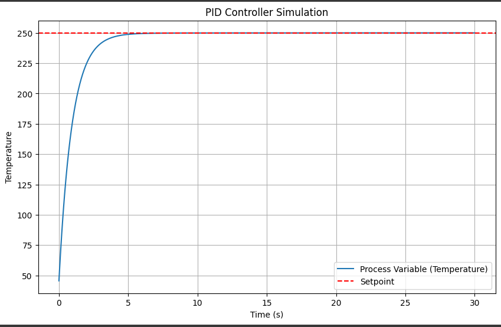
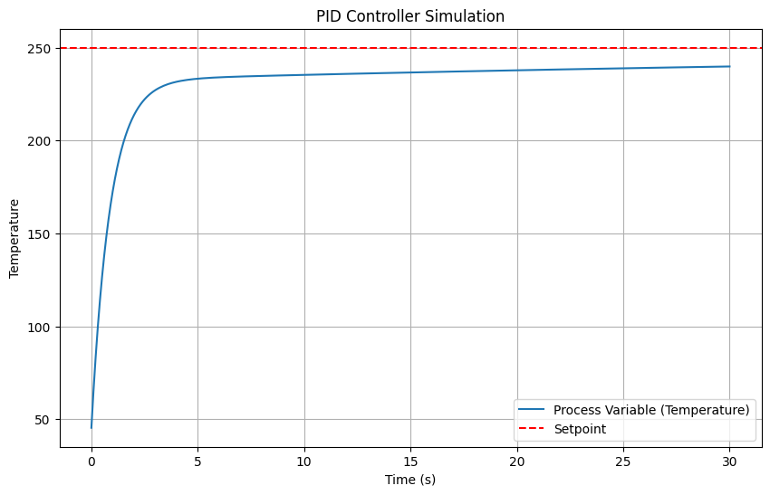
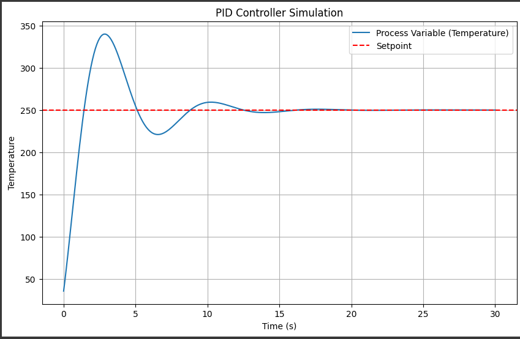
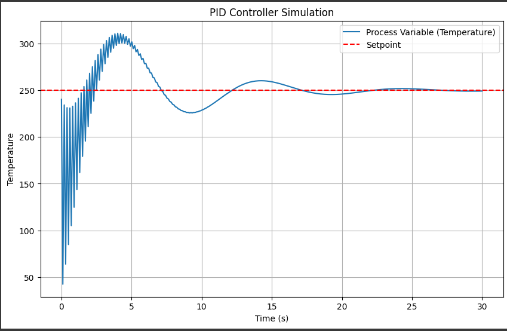

In my previous experiment, I implemented a PID controller to regulate the speed of a DC motor. It was our first real taste of translating control equations into Python -- and seeing the setpoint being reached was indeed deeply satisfying.

Back there, I alluded that motor speed control is just one of several kinds of processes. Many real-world systems -- from industrial furnaces to incubators and coffee machines -- involve temperature control, which brings its own set of dynamics.

In this experiment, I wanted to explore how a PID controller behaves when tasked with heating a system up to a target temperature, while also dealing with natural heat loss. The result is a neat little simulation that mirrors real-life thermal processes.

## The Scenario

Imagine we have a chamber at 20 °C, and we want to heat it to 200 °C using a PID controller. Our heater supplies heat proportional to the controller's output, but the environment is constantly pulling heat away -- the hotter the chamber, the faster it loses heat. 

This creates a dynamic tug-of-war between:
- Heating: Driven by the PID controller's output.
- Cooling: Proportional to the difference between current temperature and ambient temperature (20 °C).

This is a classical first order thermal system, and a perfect candidate for PID control.

## The Math

First-order systems have predictable exponential behavior and are relatively easy to stabilize with PID. That’s why thermal systems are often used as the “hello world” of real-world control experiments: the math is clean, but the dynamics are realistic enough to teach meaningful tuning.

Before writing any code, it's important to understand the mathematical model behind the temperature change. We'll denote:

Let's denote:

- $T(t)$ = temperature of the system (°C)
- $T_\text{amb}$ = ambient temperature (°C), here 20 °C
- $Q(t)$ = heat input (proportional to the PID output)
- $k$ = heat loss coefficient (per second)

For a simple thermal system, the **rate of change of temperature** can be modeled as:

$$
\frac{dT(t)}{dt} = Q(t) - k \left( T(t) - T_\text{amb} \right )
$$

This equation has two parts:

1. **Heating term $Q(t)$:** pushes the temperature up, controlled by the PID output.
2. **Cooling term $-k (T - T_\text{amb})$:** pulls the temperature down toward ambient, proportional to the temperature difference.

This is a **first-order linear ordinary differential equation** — the same kind of equation used to describe RC circuits, mass-spring-damper systems (in simplified form), and many natural processes.

In Python, we can’t solve differential equations continuously, so we use a **discrete-time approximation**.  
Over a small time step $\Delta t$, the differential equation becomes:

$$
T_{t+\Delta t} = T_t + \left[ Q_t - k(T_t - T_\text{amb}) \right] \Delta t
$$

This is exactly what happens in the code you'll see below:

```
process_variable += control_output * dt - 0.1 * (process_variable - 20) * dt
```


- `control_output * dt` represents **heating** over the small interval.
- `-0.1 * (process_variable - 20) * dt` represents **heat loss**, with $k = 0.1\,\text{s}^{-1}$.

The system naturally behaves like a **first-order lag**, slowly approaching steady-state unless the controller keeps adding energy.

## The PID Controller Class

This time, the PID controller is a structured Python class.

```
class PIDController:

	def __init__(self, Kp, Ki, Kd, setpoint):
		self.Kp = Kp
		self.Ki = Ki
		self.Kd = Kd
		self.setpoint = setpoint
		self.previous_error = 0
		self.integral = 0
		
	def compute(self, process_variable, dt):
		#Calculate error
		error = self.setpoint - process_variable
		  
		#Proportional Term
		P_out = self.Kp * error
		  
		#Integral Term
		self.integral += error * dt
		I_out = self.Ki * self.integral
		  
		#Derivative Term
		derivative = (error - self.previous_error)/dt
		D_out = self.Kd * derivative
		  
		#Compute Total Output
		output = P_out + I_out + D_out
		  
		#Update Previous Error
		self.previous_error = error
		
		return output
```


## Simulating Heating and Cooling Dynamics

We set up a simple simulation over 10 seconds with 100 time steps. The control output heats the system, while a cooling term continuously pulls the temperature toward ambient.

```
import matplotlib.pyplot as plt
import numpy as np

#Initialize PID Controller
setpoint = 200 #Desired Temperature
pid = PIDController(Kp=1.0, Ki=0.1, Kd=0.01, setpoint=setpoint)

#Simulation Parameters
time = np.linspace(0,10,100) #10 Seconds, 100 Steps
dt = time[1] - time[0]
process_variable = 20 #Initial Temperature
process_values = []

#Simulate the Process
for t in time:
  #PID Control Output
  control_output = pid.compute(process_variable,dt)

  #Simulate process dynamics (heating rate proprtional to control output)
  process_variable += control_output * dt - 0.1 * (process_variable - 20) * dt #Heat Loss

  #Store the process variable
  process_values.append(process_variable)

# Plot results
plt.figure(figsize=(10, 6))
plt.plot(time, process_values, label='Process Variable (Temperature)')
plt.axhline(y=setpoint, color='r', linestyle='--', label='Setpoint')
plt.xlabel('Time (s)')
plt.ylabel('Temperature')
plt.title('PID Controller Simulation')
plt.legend()
plt.grid()
plt.show()
```

## The Results

- $K_p$ = 1.0
- $K_i$ = 0.1
- $K_d$ = 0.01
- Setpoint = 250 °C

This curve is rather ideal, wouldn't you say?



- $K_p$ = 1.0
- $K_i$ = 0.02
- $K_d$ = 0.01
- Setpoint = 250 °C

Turning down $K_i$ causes the curve to not reach its setpoint in 30 seconds.  


- $K_p$ = 0.5
- $K_i$ = 0.8
- $K_d$ = 0.01
- Setpoint = 250 °C

A low $K_p$ and a high $K_i$ induces a wild overshoot.  


- $K_p$ = 0.5
- $K_i$ = 0.8
- $K_d$ = 0.9
- Setpoint = 250 °C

You can see that we reduced overshoot from 350 °C to 300 °C by turning up $K_d$ , but amplified high-frequency noise in the process. Be extra-careful while fidgeting with $K_d$, I'd say it's best to tune $K_p$ and $K_i$ before touching $K_d$.  


## Key Takeaways

- The temperature curve rises smoothly from 20 °C toward the 200 °C setpoint. The PID controller steadily adjusts the heating power, while the system constantly loses heat to the environment.
- Unlike the motor speed example, this experiment introduces **process dynamics** that resist the controller. This makes tuning more meaningful and shows why PID is so widely used in thermal applications.

In the next experiment, we'll see how a first-order system would perform with and without the presence of a closed-loop controller like the PID. 

---