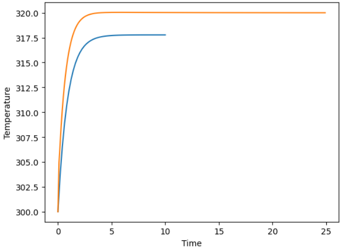
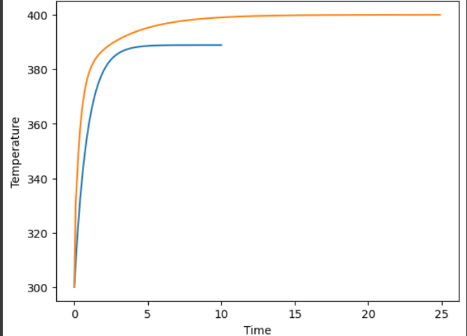

In the previous experiment, I implemented a PID controller to regulate temperature for a simple first-order system. Here, we'll understand why we need such controllers in the first place.

To explore this question, I decided to compare how a thermal system behaves in open loop (no feedback, fixed heater input) vs closed loop (PID-controller heater input). The difference was dramatic -- and it illustrates the essence of control theory.

## The Setup

We start with a thermal system whose temperature evolves according to a slightly more complex differential equation than before:

$$
\frac{dT(t)}{dt} = \frac{1}{\tau (1 + \varepsilon)} (T_f - T(t)) + \frac{Q}{(1 + \varepsilon)} (T_q - T(t))
$$

Where:

- $T(t)$ = System Temperature (K)
- $T_f$ = Ambient Temperature (K), here 300
- $T_q$ = Heater Temperature (The Manipulated Variable)
- $\tau$ = Time constant of the system
- $\varepsilon$ = Parameter affecting process dynamics
- $Q$ = Heat transfer coefficient

This model incorporates both environmental effects and heater influence, giving it more realistic behaviour than a simple first-order model.

## Simulating Open-Loop Behaviour

In the **open-loop** scenario, the heater is simply set to a fixed value like 320K, and the system temperature evolves naturally without any feedback.

```
tspan = np.linspace(0, 10, 50)
Tq = 320,  # fixed heater setting
sol = odeint(system, 300, tspan, args=Tq, tfirst=True)

plt.plot(tspan, sol)
plt.xlabel('Time')
plt.ylabel('Temperature (K)')
plt.title('Open-Loop Response')
plt.grid(True)
```

The resulting curve shows how the system **settles at some equilibrium temperature**, but there's **no guarantee** it reaches the desired setpoint. If the heater power is too low, the system undershoots; if it’s too high, it overshoots and stays above target. There’s no mechanism to self-correct.

## Adding PID Feedback (Closed Loop)

Now let's close the loop. Instead of fixing the heater temperature, we continuously adjust it based on the error between the setpoint and the actual temperature, using the PID controller.

$$
MV(t) = \text{offset} + K_p e(t) + K_i \int e(t) \, dt + K_d \frac{de(t)}{dt}
$$

Where the **manipulated variable** (MV) is the heater temperature $Tq$. 

```
# PID gains
Kp, Ki, Kd = 0.6, 0.2, 0.1
setpoint = 320

# Simulation parameters
n = 250
deltat = 0.1
y_sol = [300]  # initial temperature
t_sol = [0]
q_sol = [320]

time_prev = 0
integral = 0

for i in range(1, n):
    time = i * deltat
    # Compute new heater temperature using PID
    Tq = PID(Kp, Ki, Kd, setpoint, y_sol[-1]),
    # Integrate system dynamics over this time step
    tspan = np.linspace(time_prev, time, 10)
    yi = odeint(system, y_sol[-1], tspan, args=Tq, tfirst=True)

    t_sol.append(time)
    y_sol.append(yi[-1][0])
    q_sol.append(Tq[0])
    time_prev = time

plt.plot(t_sol, y_sol)
plt.xlabel('Time')
plt.ylabel('Temperature (K)')
plt.title('Closed-Loop PID Response')
plt.grid(True)

```

The PID controller constantly compares the current temperature to the target, adjusts the heater temperature accordingly, and drives the system toward the setpoint despite the process dynamics.

---
## Open Loop vs Closed Loop: 

In open loop, the system drifts to a natural equilibrium determined by the fixed heater setting. If that equilibrium doesn’t match the target temperature, nothing can fix it, because the system has no idea what the target is.

In closed loop, the PID controller introduces feedback. It senses error and compensates for it, allowing the system to:

- Correct for offsets
- Adapt to changing conditions
- Reach the desired temperature more reliably

In practical terms, this is why industrial heating systems always use closed-loop control. Fixed heater settings can’t handle disturbances or nonlinearities.


In this graph, orange represents closed-loop control, blue represents open-loop control. The setpoint stands at is 320K.




At Setpoint = 400K



In the upcoming article, we'll conclude our discussion of PID with a simulation of a classical spring-mass damper system. That'll give us the groundwork for diving into more advanced control topics such as LQR.

---


