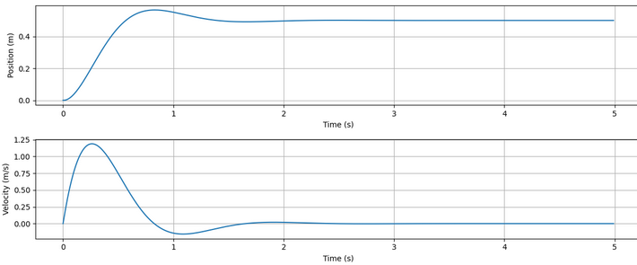
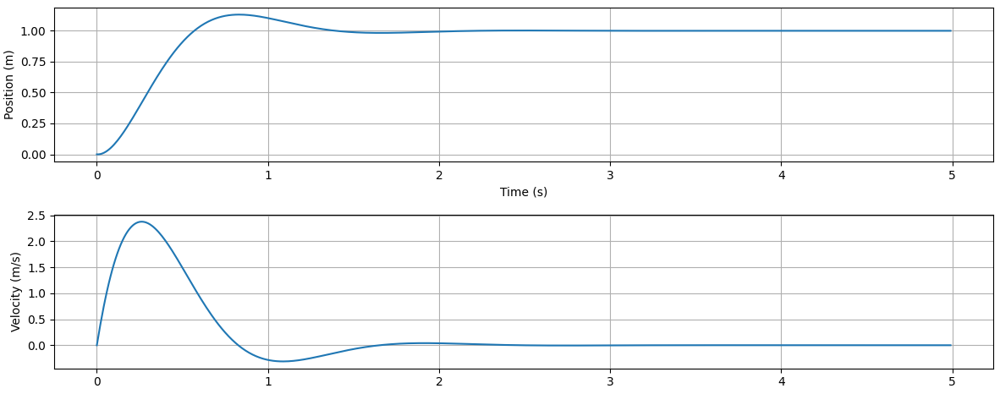
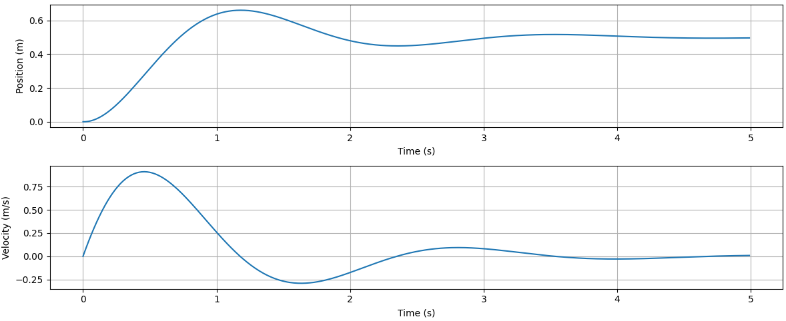

The spring-mass-damper system is a fundamental mechanical system that captures the essence of second-order dynamics. It's often used as a benchmark for understanding control systems, vibrations, and systems responses like overshoot and damping. Here, we simulate the response of such a system to a constant external force.

---
## System Dynamics

Consider a mass $m$ attached to a spring of stiffness $k$ and a damper with damping coefficient $b$. When a force $u(t)$ is applied, the equation of motion is:

$$
m\ddot{x}(t) + b\dot{x}(t) + kx(t) = u(t)
$$
where:
- ${x}(t)$ is the displacement of the mass,
- $\dot{x}(t)$ is the velocity,
- $\ddot{x}(t)$ is the acceleration.

Rearranging:

$$
\ddot{x}(t) = \frac{1}{m} \left[ u(t) - b\dot{x}(t) - kx(t) \right]
$$

This is a second-order linear differential equation , which we can express in state-space form by defining the state vector:

$$
\mathbf{x}(t) =
\begin{bmatrix}
x(t) \\
\dot{x}(t)
\end{bmatrix}
$$

Then:

$$
\dot{\mathbf{x}}(t) =
\underbrace{
\begin{bmatrix}
0 & 1 \\
-\frac{k}{m} & -\frac{b}{m}
\end{bmatrix}
}_{A}
\mathbf{x}(t)
+
\underbrace{
\begin{bmatrix}
0 \\
\frac{1}{m}
\end{bmatrix}
}_{B}
u(t)
$$

This is the continuous-time model of the system.

---
## Discretization

To simulate the system numerically, we discretize it using a simple **forward Euler** method:

$$
\mathbf{x}_{k+1} = \mathbf{x}_k + \dot{\mathbf{x}}_k \cdot \Delta t
$$

This yields the discrete matrices:

$$
A_d = I + A \Delta t \quad,\quad B_d = B \Delta t
$$

where $\Delta t$ is the timestep.

---
## Simulation

```
import numpy as np
import matplotlib.pyplot as plt

#System Parameters
m = 1.0   #Mass (kg)
k = 20.0  #Spring Constant (N/m)
b = 5.0   #Damping Coefficient (Ns/m)

#Continuous Time Matrices
A = np.array([[0, 1],
              [-k/m, -b/m]])
B = np.array([[0],
              [1/m]])

#Discretization Parameters
dt = 0.01 #Time Steps
Ad = np.eye(2) + A*dt
Bd = B*dt

#Simulation Setup
n_steps = 500
x = np.array([[0],  #Initial State: [Position = 0 m, Velocity = 0 m/s]
              [0]])
u = 10.0            #Constant Applied Force (N)

x_history = []
time_history = []

for i in range(n_steps):
  time = i*dt
  x_history.append(x.flatten())
  time_history.append(time)

  x = Ad @ x + Bd * u

x_history = np.array(x_history)

# Plot results
plt.figure(figsize=(12,5))
plt.subplot(2,1,1)
plt.plot(time_history, x_history[:,0], label="Position (m)")
plt.xlabel('Time (s)')
plt.ylabel('Position (m)')
plt.grid(True)

plt.subplot(2,1,2)
plt.plot(time_history, x_history[:,1], label="Velocity (m/s)")
plt.xlabel('Time (s)')
plt.ylabel('Velocity (m/s)')
plt.grid(True)

plt.tight_layout()
plt.show()
```

---
## Results:

With the system parameters:

	m = 1.0  Mass (kg)
	k = 20.0 Spring Constant (N/m)
	b = 5.0 Damping Coefficient (Ns/m)
	u = 10.0 Constant Applied Force (N)



Doubling the force to 20 N yields:



@ 	 
	m = 1.0  Mass (kg)
	k = 20.0 Spring Constant (N/m)
	b = 5.0 Damping Coefficient (Ns/m)
	u = 10.0 Constant Applied Force (N)
	



---
## Key Takeaways

While PID controllers are powerful and intuitive, especially for first-order or slowly varying systems, they can struggle when dealing with **higher-order dynamics** like those of the spring–mass–damper. Tuning becomes less straightforward, and achieving fast, stable responses without overshoot often requires compromise. This is where **modern control techniques** come in. By formulating the system in state-space, we unlock the ability to design controllers that **explicitly account for the system’s dynamics**, enabling precise shaping of transient behavior. In the next step, we’ll move beyond PID and explore methods like **Linear Quadratic Regulation (LQR)**, which use mathematical optimization to find control laws that balance performance and control effort elegantly.

---